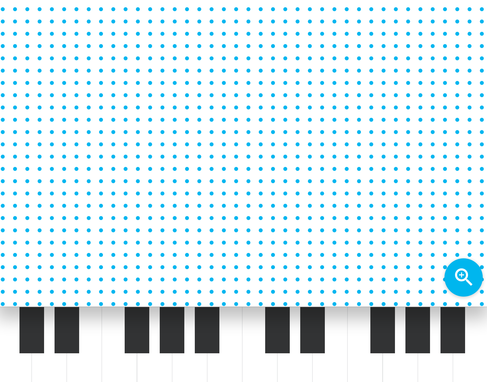

SoundWaves

Soundwaves is an audio experiment that attempts to visualise the underlying properties of a sound wave.

The experiments uses [Tone.js](https://github.com/Tonejs/Tone.js) and WebGL.

### To develop yourself

Run `npm install` then `gulp` and you're good to go

This is not an official Google product